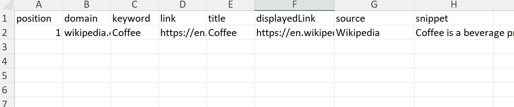
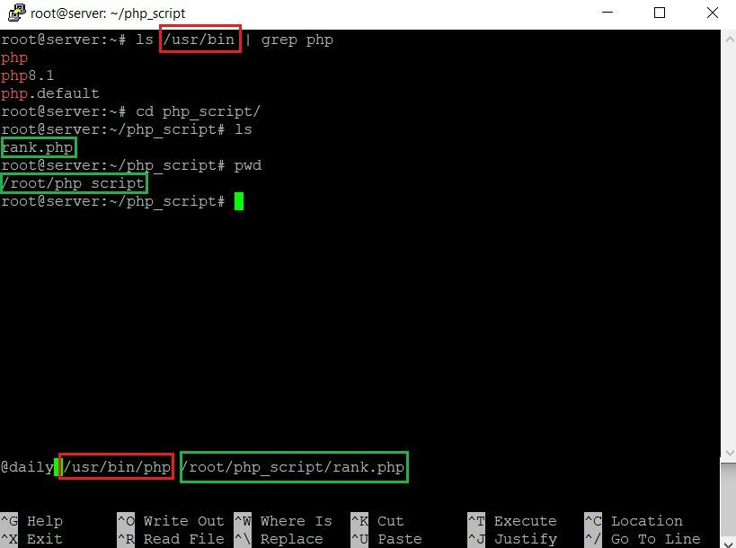

# Build Your Own Keyword Rank Checker with PHP 

Rank checking is all about tracking where your site shows up on Google for the keywords that matter. It’s a key part of SEO, showing you how visible your site really is, and where you need to step up. There are plenty of ready-made [rank checking tools](https://hasdata.com/blog/rank-tracking-apis), but they can be stiff, overpriced, and not always what you need.

This guide shows you how to build your own rank checker in PHP. PHP’s simple, powerful, and flexible - good for this job. It’s got a huge community and plenty of tools to get things done.

## Table of Contents

- [What You’ll Need](#what-youll-need)
- [Building a Keyword Rank Checker](#building-a-keyword-rank-checker)
  - [Scraping Google Results the Smart Way](#scraping-google-results-the-smart-way)
  - [Import Libraries and Make a Request](#import-libraries-and-make-a-request)
  - [Parsing and Extracting Keyword Ranks](#parsing-and-extracting-keyword-ranks)
  - [Storing and Presenting Results](#storing-and-presenting-results)
  - [Scheduling and Automation](#scheduling-and-automation)
- [Enhancing the Keyword Rank Checker PHP Script](#enhancing-the-keyword-rank-checker-php-script)
  - [SERP Snapshot](#serp-snapshot)
  - [Featured Snippets and Date](#featured-snippets-and-date)
- [Conclusion](#conclusion)

## What You’ll Need

PHP’s an old player in web dev. In a [previous article](https://hasdata.com/blog/php-web-scraping-libraries), I covered how to set up PHP, what tools to use, and how to scrape data.

I won’t rehash that here. Just make sure you’ve got:

- PHP 8.3.0 ([download it here](https://www.php.net/downloads.php))  
- Composer 2.6.6 ([get it here](https://getcomposer.org/download/))  
- Maven or Gradle (optional)  

Or skip the hassle and use something like XAMPP to spin up a PHP dev environment fast.

## Building a Keyword Rank Checker

A keyword rank checker tracks where your site ranks for chosen keywords in search results.

Why do this? Because it tells you how your SEO is working, which keywords are worth the effort, and where your competition is sitting. It’s also an early warning if something’s broken on your site or if you’re hit by a Google penalty.

This info helps you make smart SEO decisions—whether it’s content, site tweaks, or link building.

### Scraping Google Results the Smart Way

Google’s the top search engine, so your rank checker should focus there. But scraping Google’s SERPs directly is tricky—CAPTCHAs, IP blocks, changing page structures. We’ve already covered [how to scrape Google](https://hasdata.com/blog/scrape-google-search-results), but there’s a better way.

Instead of wrestling with scraping, use HasData’s [SERP API](https://hasdata.com/apis/google-serp-api). It gives you structured search data, no scraping needed.

Here’s why it’s the smart move:

1. It delivers clean, ready-to-use data.  
2. No proxies required.  
3. No CAPTCHAs to solve.  
4. If Google changes its page layout, the API handles it for you.  
5. Simple enough for beginners.  

If this feels overwhelming, there’s a shortcut: we’ve already put together a [Google Sheets rank tracker](https://hasdata.com/blog/google-sheets-rank-tracker) with a scraper. You can just use the template and start tracking your ranks right away.

But if you want to build your own tool in PHP, this guide has you covered.

### Import Libraries and Make a Request

As we mentioned earlier, we will use Composer to import libraries. To do this, create a new file named composer.json and add the libraries used in the project. We will use the httpful library, so the file contents will be as follows:

    {
        "require": {
            "nategood/httpful": "*"
        }
    }
    

You can also replace \* with a specific library version, but if you are unsure or just want to use the latest compatible version, leave \*.

Create a file with the extension .php and import the necessary modules:

    <?php
    require 'vendor/autoload.php';
    use Httpful\Request;
    
    // Here will be code
    
    ?>
    

Set the parameters that we will pass to the API. You can find the full list in the official documentation, but we will only use the basics:

    $location = 'Austin,Texas,United States';
    $query = 'Coffee';
    $filter = 1;
    $domain = 'google.com';
    $gl = 'us';
    $hl = 'en';
    $deviceType = 'desktop';
    

The most critical parameter is the contents of the variable $query, which stores the keyword or phrase for which the query is executed. You can also configure the localization and language of the search engine to get the most relevant data.

Set the domain of the resource for which the position search will be performed:

    $searchedDomain = 'wikipedia.org';
    

We also need to specify the request header to pass the unique API key that can be found in your account after registering on the HasData website:

    $headers = array(
        'x-api-key' => YOUR-API-KEY',
    );
    

Then, assemble the request string:

    $url = sprintf(
        'https://api.hasdata.com/scrape/google?location=%s&q=%s&filter=%d&domain=%s&gl=%s&hl=%s&deviceType=%s',
        rawurlencode($location),
        rawurlencode($query),
        $filter,
        rawurlencode($domain),
        rawurlencode($gl),
        rawurlencode($hl),
        rawurlencode($deviceType)
    );
    

And execute the resulting request:

    $response = Request::get($url)
        ->addHeaders($headers)
        ->send();
    

After this, the request will return a response, which we will process further.

### Parsing and Extracting Keyword Ranks

The SERP API response returns a JSON object with the necessary data. Before we proceed to retrieve the required parameters, let’s take a look at the JSON response structure:

The JSON response structure

For the simplest Rank Checker, we can use the contents of the organicResults attribute. However, we will later add the date and time of the check, the link to the query page, and show how to get data from rich snippets.

Let’s decode the JSON response and store the result in a variable for further processing.

    $data = json_decode($response->raw_body, true);
    

First, check if the JSON response is empty. If the request fails, we should stop the script and display an error message.

    if (!is_array($data) || empty($data)) {
        die('Error with JSON decoding or Empty data');
    }
    

Next, we should ensure that the organicResults property contains data and is an array. If not, we should also stop the script.

    if (isset($data['organicResults']) && is_array($data['organicResults']) && !empty($data['organicResults'])) {
        // Here will be code
    } else {
        die('organicResults is empty');
    }
    

Now, let’s create a variable to store the position data.

        $result = array();
    

Iterate over the organicResults array and find the results that contain the domain in the URL.

        foreach ($data['organicResults'] as $item) {
            if (isset($item['link']) && strpos($item['link'], $searchedDomain) !== false) {
                // Here will be code
            }
        }
    

Finally, we can store the position, google keyword, domain, and other data in the results variable.

                $result[] = array(
                    'position' => $item['position'],
                    'domain' => $searchedDomain,
                    'keyword'=> $query,
                    'link' => $item['link'],
                    'title' => $item['title'],
                    'displayedLink' => $item['displayedLink'],
                    'source' => $item['source'],
                    'snippet' => $item['snippet'],
           );
    

At this step, you have the desired data in the results variable. You can either process it further, display it on the screen, or save it in a convenient format for future use or storage.

### Storing and Presenting Results

As search engine ranking data has a certain structure, storing it in a tabular format is very convenient. CSV is one of the most popular formats, supported by most operating systems. Therefore, consider saving the obtained data set to a CSV file step by step.

Set the name of the file with rank data:

        $csvFilePath = 'rank_checker.csv';
    

Check if the file exists at the current time:

        $fileExists = file_exists($csvFilePath);
    

Then, open the file to add data to the end of the file. If you want the file to be overwritten each time, use the “w” parameter instead of “a”.

        $file = fopen($csvFilePath, 'a');
    

Now let’s check if the file is empty or did not exist previously, then set the column headers:

        if (!$fileExists || filesize($csvFilePath) == 0) {
            fputcsv($file, array_keys($result[0]));
        }
    

Enter the collected data line by line in case the domain name was found in the search results several times:

        foreach ($result as $row) {
            fputcsv($file, $row);
        }
    

Finally, don’t forget to close the file:

        fclose($file);
    

To know if the data was saved successfully, you can output a notification to the command line:

        echo 'Data saved to CSV file: ' . $csvFilePath;
    

The last action is not mandatory, but it allows you to have an idea of the current stage of the script execution. As a result of the execution, you will get a file with similar content:

A CSV file with Rank Check results.

As the script is launched, the file’s contents will be updated, and over time, you will be able to have detailed data on the position changes in a convenient format.

### Scheduling and Automation

To automate ranking position, you can use the built-in system features. For example, on Windows, this creates a task in the Task Scheduler, and on Linux, it uses Cron. Adding tasks to the Task Scheduler is visual and intuitive, so we will not dwell on it.

Let’s consider how to add PHP Rank Checker to Cron, with a launch frequency of once a day. To do this, you need to know the location of the PHP package and your PHP rank checker.

A computer screen displaying the terminal interface with the crontab command.

Then, you need to set a rule for Cron. You can use a [task generation service](https://crontab.guru/) for this. In our case, it will be enough for a daily launch to use @daily.

Now, let’s go to the Cron job configuration file. To do this, type the following command in the terminal:

    crontab -e
    

Then, add a new task line in the form of “frequency location-of-php-package location-of-rank-checker,” for example:

    @daily /usr/bin/php /root/php_script/rank.php
    

After that, save your changes and close the editor. You can later view existing tasks using the following command:

    crontab -l
    

To delete a task from Cron, you can use the same command to launch the editor when you add a new task. Simply delete the necessary line.

Enhancing the Keyword Rank Checker PHP Script
---------------------------------------------

While functional, the previous version of the SERP checker does not save all the data we would like. As you can see from the structure of the returned JSON, we can get a larger number of parameters. Therefore, let’s add to the previous script and save the most useful ones.

### SERP Snapshot

One of the most important and useful parameters we receive from the SERP API is the SERP snapshot. In our case, this is a link you can click to see what the search results looked like at the time of the position check. This is very important if you want to know, for example, the top 10 results, who was in first place, and who occupied the positions before and after your resource.

The link to the SERP snapshot is located in the googleHtmlFile attribute, so let’s add some additional parameters to our $results variable:

                $result[] = array(
                    'position' => $item['position'],
                    'domain' => $searchedDomain,
                    'keyword'=> $query,
                    'link' => $item['link'],
                    'title' => $item['title'],
                    'displayedLink' => $item['displayedLink'],
                    'source' => $item['source'],
                    'snippet' => $item['snippet'],
                    'googleUrl' => $data['requestMetadata']['googleUrl'],
                    'googleHtmlFile' => $data['requestMetadata']['googleHtmlFile'],
                );
    

The rest of the code will remain unchanged.

### Featured Snippets and Date

Another useful parameter to include is the date and time. While we can collect data and observe changes over time, we won’t be able to build accurate charts without knowing the specific dates of each check. To address this, let’s add a new parameter to the variable $result:

                    'position' => $item['position'],
                    'domain' => $searchedDomain,
                    'keyword'=> $query,
                    'link' => $item['link'],
                    'title' => $item['title'],
                    'displayedLink' => $item['displayedLink'],
                    'source' => $item['source'],
                    'snippet' => $item['snippet'],
                    'googleUrl' => $data['requestMetadata']['googleUrl'],
                    'googleHtmlFile' => $data['requestMetadata']['googleHtmlFile'],
                    'date' => date('Y-m-d H:i:s'),
    

In addition to the search results, you can also access other data from the JSON response, such as People also ask or Related Questions. For example, to get related questions data, you can use the following code:

        $relatedQuestions = array();
    
        foreach ($data['relatedQuestions'] as $question) {
            $relatedQuestions[] = array(
                'title' => $question['title'],
                'link' => $question['link'],
                'source' => $question['source'],
                'snippet' => $question['snippet'],
            );
        }
    

Thus, you can customize the format and amount of data you receive from the Google SERP API.

Conclusion
----------

In this article, we walked through how to build a simple rank checker in PHP using the SERP API. We covered the basics—getting the data, saving a snapshot, and pulling the current date and time.

We also added the full script to thes repo, so you can see exactly how it works.

The SERP API gives you more data than we used in the example. If you check the JSON structure, you’ll see you can tweak your script to grab whatever extra data you need.
